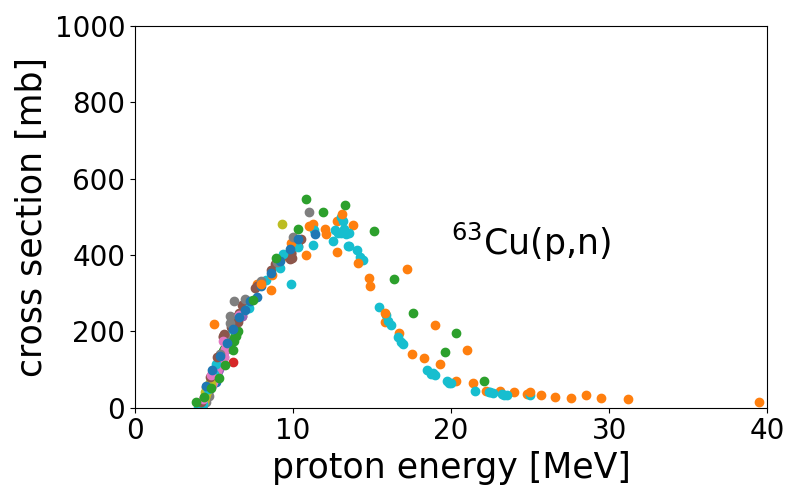

# nuclyr - a utility package for nuclear physics

## Build

The package **nuclyr** is available via `pip`. Just run:

```
pip install nuclyr
```

Or just clone the repository and build it from there using `setup.py`.

For the webscraping part of the package a driver for your favorite browser is needed, e.g. `chromedriver`  or `msedgedriver`. You can find them via the following links:

* [Chromedriver](https://sites.google.com/a/chromium.org/chromedriver/)
* [Edgedriver](https://developer.microsoft.com/en-us/microsoft-edge/tools/webdriver/)

Please make sure, you're downloading the right version for your browser.

## Config

At start nuclyr will create a configuration file in your home directory called `.nuclyr` which is in JSON format. You can easily edit all the package configurations with your prefered text editor, e.g. the location of the webdriver. 

The configurations can also be added within a python script via:
``` python
import nuclyr.config as cf

#Setting driver_loc to "path/to/driver"
cf.Set("driver_loc", "path/to/driver") 

#Getting the current options for the driver location
cf.Get("driver_loc") 

#print the whole configuration file
cf.Show() 
```
## nuclyr - exfor

This submodule is for mineing up-to-date reaction data from the [EXFOR](https://www-nds.iaea.org/exfor/exfor.htm) data base.

A simple example to mine the cross section data for `63Cu(p,n)` would look like:

```python
#import nuclyr modules
import nuclyr.config as cf
from nuclyr import exfor

#import pyplot for plotting the data
import matplotlib.pyplot as plt

#definition of target and reaction of interest
target="63Cu"
reaction="p,n"

#setting the driver location
cf.Set("driver_loc","path/to/driver")

#obtaining the data via exfor.getSig()
data, legend = exfor.getSIG(target,reaction)

#plotting the dataframes
plt.figure(1, figsize=(8,5))

plt.xlim(xmin=0, xmax=40)
plt.ylim(ymin=0, ymax=1000)
plt.xlabel("proton energy [MeV]", size=25)
plt.ylabel("cross section [mb]", size=25)
plt.text(20, 400, r"$^{63}$Cu(p,n)", size=25)
plt.gca().tick_params(labelsize=20)

for df in data:
    plt.scatter(df[('EN','MEV')], df[('DATA','MB')])

plt.tight_layout()
plt.show()
```

The result would look like:

.

