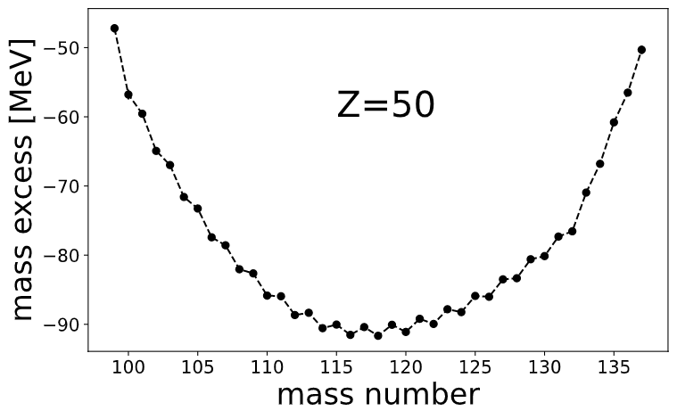
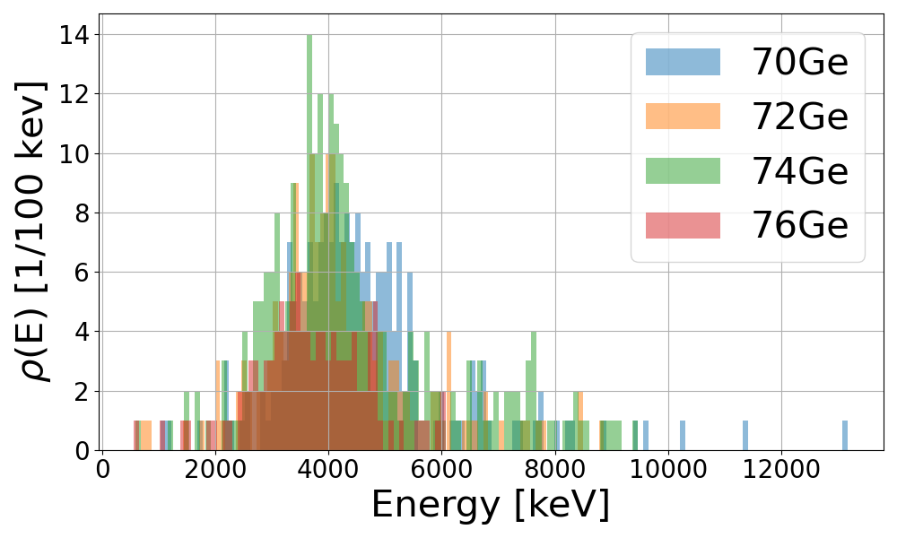

# nuclyr - an utility package for nuclear physics
1. [Motivation](#motivation)
2. [Build](#build)
3. [Config](#config)
4. [Submodules](#submodules)
    1. [exfor](#exfor)
    2. [mass](#mass)
    3. [nndc](#nndc)
---
## Motivation
Often data analysis in nuclear physics depends on up-to-date values for specific parameters, e.g. cross sections, masses, half-lives. 
`nuclyr` is a python package which should provide such functionality. It will grow over time depending on what I personally need for my analysis. 
At the moment `nuclyr` includes the following features:

* Obtain up-to-date **cross section data** from the [EXFOR](https://www-nds.iaea.org/exfor/exfor.htm) database as pandas dataframes via the [exfor](#exfor) submodule
* Get up-to-date **atomic masses, massExcess**, and calculate **QValues** via the [mass](#mass) submodule
* Get up-to-date **level scheme information** from [NNDC](https://www.nndc.bnl.gov/) via the [nndc](#nndc) submodule
* Rather useful constants in nuclear physics via `nuclyr.constants`

## Build

The package **nuclyr** is available via `pip`. See [https://pypi.org/project/nuclyr/](https://pypi.org/project/nuclyr/).

Just run:

```
pip install nuclyr
```

Or just clone the repository and build it from there using `setup.py`.

For the webscraping part of the package a driver for your favorite browser is needed, e.g. `chromedriver`  or `msedgedriver`. You can find them via the following links:

* [Chromedriver](https://sites.google.com/a/chromium.org/chromedriver/)
* [Edgedriver](https://developer.microsoft.com/en-us/microsoft-edge/tools/webdriver/)

Please make sure, you're downloading the right version for your browser.

## Config

At start nuclyr will create a configuration file in your home directory called `.nuclyr` which is in JSON format. You can easily edit all the package configurations with your prefered text editor, e.g. the location of the webdriver. 

The configurations can also be added within a python script via:
``` python
import nuclyr.config as cf

#Setting driver_loc to "path/to/driver"
cf.Set("driver_loc", "path/to/driver") 

#Getting the current options for the driver location
cf.Get("driver_loc") 

#print the whole configuration file
cf.Show() 
```
## Submodules

### exfor

This submodule is for mineing up-to-date reaction data from the [EXFOR](https://www-nds.iaea.org/exfor/exfor.htm) data base.

A simple example to mine the cross section data for `63Cu(p,n)` would look like:

```python
#import nuclyr modules
import nuclyr.config as cf
from nuclyr import exfor

#import pyplot for plotting the data
import matplotlib.pyplot as plt

#definition of target and reaction of interest
target="63Cu"
reaction="p,n"

#setting the driver location
cf.Set("driver_loc","path/to/driver")

#obtaining the data via exfor.getSig()
data, legend = exfor.getSIG(target,reaction)

#plotting the dataframes
plt.figure(1, figsize=(8,5))

plt.xlim(xmin=0, xmax=40)
plt.ylim(ymin=0, ymax=1000)
plt.xlabel("proton energy [MeV]", size=25)
plt.ylabel("cross section [mb]", size=25)
plt.text(20, 400, r"$^{63}$Cu(p,n)", size=25)
plt.gca().tick_params(labelsize=20)

for df in data:
    plt.scatter(df[('EN','MEV')], df[('DATA','MB')])

plt.tight_layout()
plt.show()
```

The result would look like:

.

### mass

You want to use recommended values for nuclear masses in your python code? You can get them via this submodule.
Here is a small example of getting the mass excesses of thin isotopes.

```python
from nuclyr import mass
import matplotlib.pyplot as plt
import numpy as np

masses = np.arange(99,138)
excess = np.zeros(len(masses))
errors = np.zeros(len(masses))

for i in range(len(masses)):
    number[i], errors[i] =mass.massExcess(50,masses[i])


plt.figure(1, figsize=(8,5))
plt.ylabel(r"mass excess [MeV]", size=25)
plt.xlabel(r"mass number", size=25)
plt.gca().tick_params(labelsize=15)
plt.text(115, -60, r"Z=50", size=30)
plt.errorbar(masses, number, yerr=errors, color="black", marker="o", linestyle="--")
plt.tight_layout()
plt.show()
```

The script above will produce the following plot:


### nndc
Sometimes a nuclear physicist is interested in up-to-date level information of an isotope. It would be really handy to obtain these data in an automatic way.
For this, the `nndc` submodule is implemented which helps you to read level information for a specific isotope from the [NNDC-database](https://www.nndc.bnl.gov/) which get their values from the [Nuclear Data Sheets](https://www.sciencedirect.com/journal/nuclear-data-sheets).

The following example shows, how one can obtain the levelscheme as a pandas dataframe an plot the energies of the levels as a histogram for several germanium isotopes. 
```python
import nuclyr.nndc as nndc
import pandas as pd
import matplotlib.pyplot as plt

scheme1 = nndc.levelscheme("70Ge")
scheme2 = nndc.levelscheme("72Ge")
scheme3 = nndc.levelscheme("74Ge")
scheme4 = nndc.levelscheme("76Ge")

df1 = scheme1.energies()
df2 = scheme2.energies()
df3 = scheme3.energies()
df4 = scheme4.energies()


plt.figure(1, figsize=(10,6))
plt.xlabel(r"Energy [keV]", size=30)
plt.ylabel(r"$\rho$(E) [1/100 kev]", size=30)
plt.gca().tick_params(labelsize=20)

df1[0].hist(bins=int(df1[0].max()/100), alpha=0.5, label=r"70Ge")
df2[0].hist(bins=int(df2[0].max()/100), alpha=0.5, label=r"72Ge")
df3[0].hist(bins=int(df3[0].max()/100), alpha=0.5, label=r"74Ge")
df4[0].hist(bins=int(df4[0].max()/100), alpha=0.5, label=r"76Ge")

plt.legend(prop={"size":30})
plt.tight_layout()
plt.show()
```

The resulting histogram is basically the experimentally observed level density and looks like the following figure:
